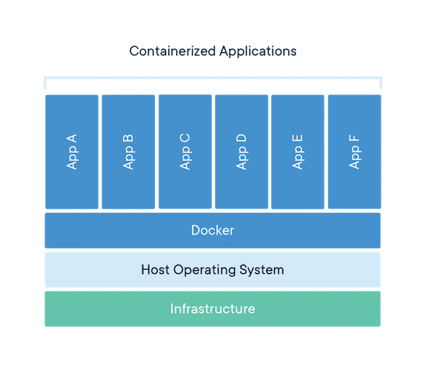

# Docker tutorial
---
## Docker install
* ### Install Docker on Windows 10
  ['도커 처음 사용자를 위한 윈도우 도커 설치 및 실행하기'](https://steemit.com/kr/@mystarlight/docker)

* ### Install Docker on MAC
  공식 홈페이지에서 **Docker Desktop for mac** 다운 및 설치  
  [https://www.docker.com/products/docker-desktop](https://www.docker.com/products/docker-desktop)
  
* ### Install Docker on Ubuntu
  ```bash
  $ sudo apt-get update
  $ sudo apt-get install docker-ce docker-ce-cli containerd.io
  ```
---
## Docker, Container, Image

