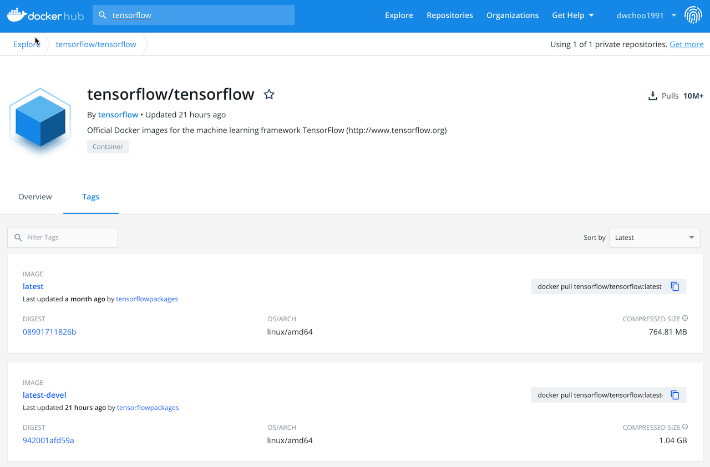
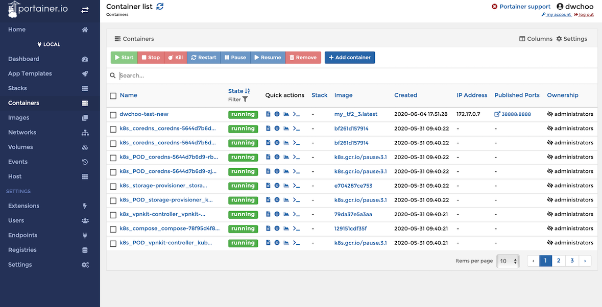

# Docker tutorial
---
## Docker install
* ### Install Docker on Windows 10
  ['도커 처음 사용자를 위한 윈도우 도커 설치 및 실행하기'](https://steemit.com/kr/@mystarlight/docker)

* ### Install Docker on MAC
  공식 홈페이지에서 **Docker Desktop for mac** 다운 및 설치  
  [https://www.docker.com/products/docker-desktop](https://www.docker.com/products/docker-desktop)
  
* ### Install Docker on Ubuntu
  ```bash
  $ sudo apt-get update
  $ sudo apt-get install docker-ce docker-ce-cli containerd.io
  ```
---
## Docker, Container, Image

* ### Docker
Docker는 **컨테이너 기반의 가상화 플랫폼**이다. 이는 Virtual machine으로 OS를 구동하는 것과는 차이가 있다.  

Docker는 Host OS kernel을 이용하여 여러개의 Application을 구동하는 반면에 VM은 Hypervisor를 활용하여 Guest OS를 올리고 그 위에 Application을 구동한다. 따라서 VM은 OS 구동에 필요한 시스템 자원이 소모되는 반면에 Docker는 VM보다 훨씬 적은 양의 시스템 자원과 메모리를 필요로 한다.

#### 머신러닝에서 Docker를 사용하는 이유
현재 많은 머신러닝 도구는 파이썬을 사용한다. 파이썬을 사용하다 보면 많은 라이브러리를 관리해야 하고 라이브러리 버전 때문에 어제는 돌아가던 코드가 오늘은 돌아가지 않는 상황이 생길 수 있고, 다양한 버전의 라이브러리를 관리하는 것은 쉽지 않다. 이를 위해서 *Conda*라는 가상 환경을 제공하는 툴이 있지만 한번 꼬인 환경을 다시 복구하거나 내가 원하는 환경을 재구성 하는데는 시간이 필요하다.  
그리고 GPU를 사용하는 딥러닝 머신은 윈도우로 구성하는 것 보다 Linux로 구성하는 것이 훨씬 안정적이며 문제가 적다. 때에 따라서는 윈도우에서는 GPU를 사용할 수 없는 경우도 있다.(맥은 CUDA를 사용할 수 없으며 AMD GPU를 활용한 딥러닝 역시 리눅스에서만 가능하다 - 특별한 경우 제외)  
이미 윈도우나 MACOS를 사용하고 있다면 듀얼부팅으로 리눅스를 설치하는 것은 부담감이 있으며 리눅스 환경 또한 설정이 꼬이거나 프로그램을 잘못 설치할 경우 환경을 복원하기 까다롭다.  
이러한 상황에서 리눅스로 머신러닝을 개발하면서 동시에 환경 설정이 쉬운 방법은 가상화(VM) 혹은 Docker 밖에 없다. 하지만 위에서 언급한 대로 VM은 시스템 자원을 필요 이상 소모하며 구동 및 재설치가 까다롭다. 그에 반에 Docker는 환경을 코드 입력 하듯이 설정 가능하며 입력된 설정 대로 Docker 이미지를 만들면 간편하게 환경을 구성할 수 있다. 가장 좋은 점은 나의 실수로 Docker 환경에 에러가 나서 복구가 불가능할 경우에도 간편하게 이전에 쓰던 이미지를 불러와서 새로 설정하면 5분도 안되서 내가 사용하던 환경을 다시 구성할 수 있다. 나아가 여러명이 사용하는 서버 환경에서 나만의 환경을 쉽게 구성 및 복구할 수 있는 프로세서를 만드는 것은 큰 이점이 있다.  
만약 리눅스 환경에서 개발을 하기 원한다면 Docker를 쓸 줄 아는 것은 기본중의 기본이다.  
*참고로 윈도우에서 Docker를 사용하더라도 GPU를 사용하는 것은 쉽지 않다.*

* ### Container
Docker의 Container는 우리가 사용할 가상 환경이라고 생각하면 쉽니다. 이 컨테이너에서 우리가 원하는 환경을 구성하고 프로그램이 돌아간다.  

* ### Image
Docker image는 Container의 환경을 정의해 놓은 틀이다. 즉 내가 원하는 환경을 정의해서 Docker image를 만들면 이 image를 불러와서 Container를 만드는 것이다. 이 Docker image는 Dockerfile(소스코드)를 통해서 Build하여 만들거나 이미 존재하는 환경을 Commit하여 만들 수 있다.(Commit 보다는 Dockerfile를 사용하여 만드는 것을 추천한다)
  
위와 같이 [hub.docker.com](https://hub.docker.com)에는 많은 환경의 이미지가 존재한다.  

---
## Portainer - 도커 사용을 위한 보조자
Docker를 사용하다 보면 익숙하지 않은 command 창이나 옵션 때문에 애먹을 때가 있다. 이를 도와주고 관리하게 도와주는 GUI 도구가 있다. 바로 **Portainer**이다.  

Portainer의 공식 홈페이지는 [https://www.portainer.io](https://www.portainer.io)이며 다음과 같은 순서로 설치할 수 있다.  
```bash
$ docker volume create portainer_data
$ docker run -d -p 8000:8000 -p 9000:9000 --name=portainer --restart=always -v /var/run/docker.sock:/var/run/docker.sock -v portainer_data:/data portainer/portainer
```
